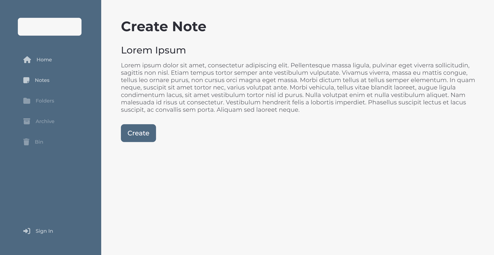

<!-- PROJECT LOGO -->
 

  

  <h3 align="center">Pomei</h3>

  

    Simple notes taking app.
     
     
    <a href="https://pomei.pages.dev">Live View</a>
    ·
    <a href="https://github.com/Dunkelhaiser/Pomei/issues">Report Bug</a>
    ·
    <a href="https://github.com/Dunkelhaiser/Pomei/issues">Request Feature</a>
  

  
Table of Contents

  <ol>
    <li>
      <a href="#about-the-project">About The Project</a>
      <ul>
        <li><a href="#built-with">Built With</a></li>
        <li><a href="#built-with">Screenshots</a></li>
      </ul>
    </li>
  </ol>

## About The Project

### Built With

-   [![Vite][Vitejs]][Vite-url]
-   [![React][React.js]][React-url]
-   [![TypeScript][TypeScriptlang]][TypeScript-url]
-   [![SASS][SASS]][SASS-url]
-   [![Node.js][Node]][Node-url]
-   [![Express.js][Express]][Express-url]
-   [![PostgreSQL][Postgres]][Postgres-url]
-   [![Prisma][Prisma]][Prisma-url]

To run project, clone repo run "npm i" and "npm run dev", or access it in https://pomei.netlify.app.

### Screenshots

[React.js]: https://img.shields.io/badge/React-20232A?style=for-the-badge&logo=react&logoColor=61DAFB
[React-url]: https://react.dev/
[SASS]: https://img.shields.io/badge/SASS-hotpink.svg?style=for-the-badge&logo=SASS&logoColor=white
[SASS-url]: https://sass-lang.com/
[TypeScriptlang]: https://img.shields.io/badge/TypeScript-007ACC?style=for-the-badge&logo=typescript&logoColor=white
[TypeScript-url]: https://www.typescriptlang.org/
[Vitejs]: https://img.shields.io/badge/vite-%23646CFF.svg?style=for-the-badge&logo=vite&logoColor=white
[Vite-url]: https://vitejs.dev/
[Node]: https://img.shields.io/badge/node.js-6DA55F?style=for-the-badge&logo=node.js&logoColor=white
[Node-url]: https://nodejs.org/
[Express]: https://img.shields.io/badge/express.js-%23404d59.svg?style=for-the-badge&logo=express&logoColor=%2361DAFB
[Express-url]: https://expressjs.com/
[Postgres]: https://img.shields.io/badge/postgres-%23316192.svg?style=for-the-badge&logo=postgresql&logoColor=white
[Postgres-url]: https://www.postgresql.org/
[Prisma]: https://img.shields.io/badge/Prisma-3982CE?style=for-the-badge&logo=Prisma&logoColor=white
[Prisma-url]: https://www.prisma.io/
